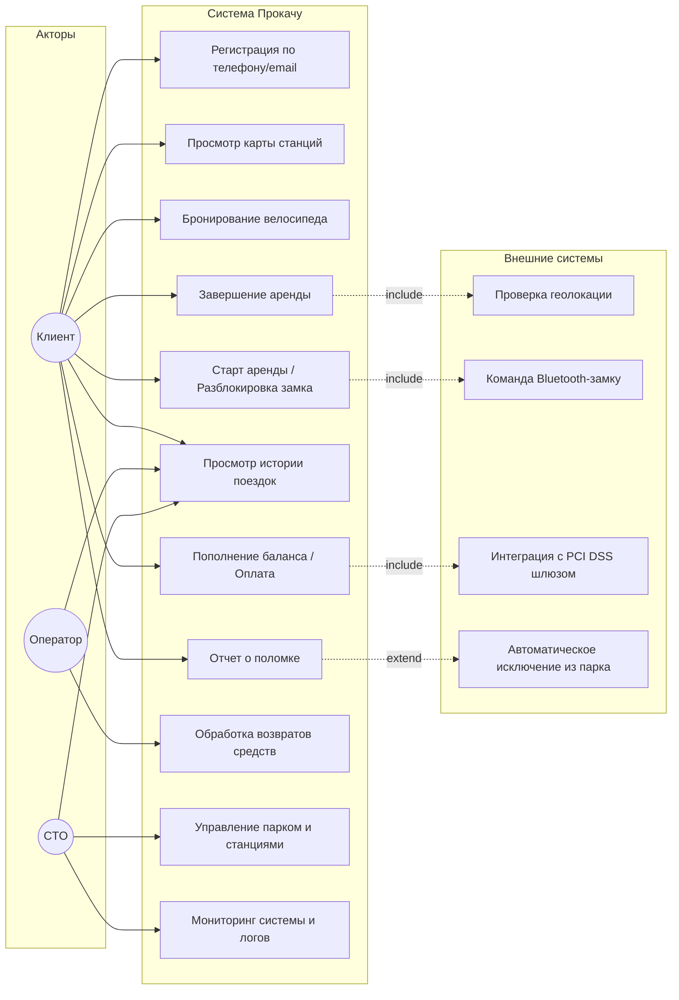
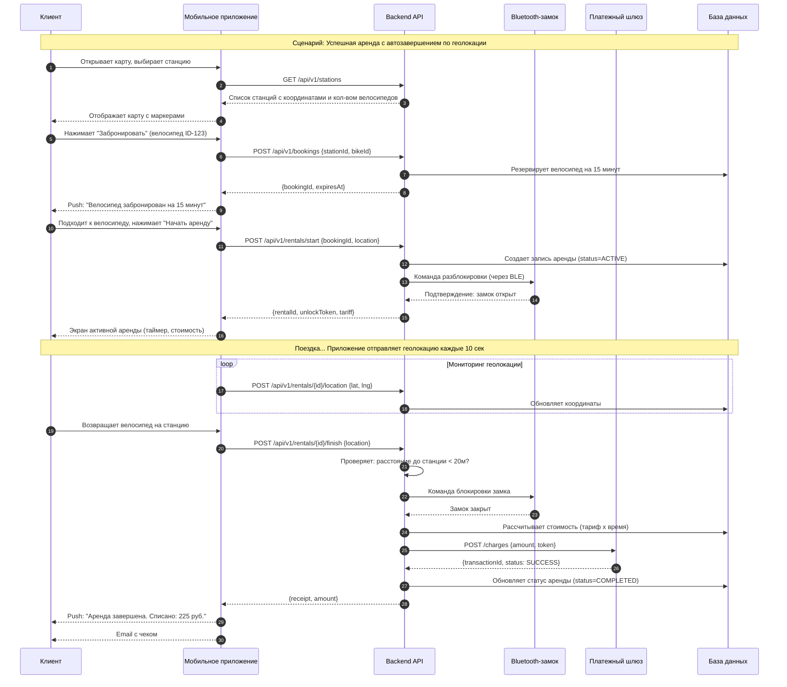
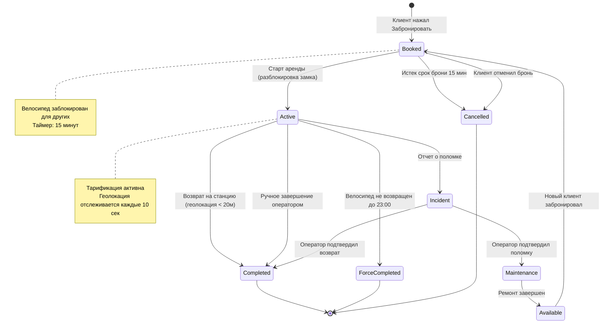

# Диаграммы проекта «Прокачу»

## 1. Use Case Diagram

```mermaid
flowchart LR
    subgraph Actours [Акторы]
        Client((Клиент))
        Operator((Оператор))
        CTO((CTO))
    end

    subgraph Prokachu [Система Прокачу]
        UC1[Регистрация по телефону/email]
        UC2[Просмотр карты станций]
        UC3[Бронирование велосипеда]
        UC4[Старт аренды / Разблокировка замка]
        UC5[Завершение аренды]
        UC6[Просмотр истории поездок]
        UC7[Отчет о поломке]
        UC8[Пополнение баланса / Оплата]
        UC9[Обработка возвратов средств]
        UC10[Управление парком и станциями]
        UC11[Мониторинг системы и логов]
    end

    Client --> UC1
    Client --> UC2
    Client --> UC3
    Client --> UC4
    Client --> UC5
    Client --> UC6
    Client --> UC7
    Client --> UC8

    Operator --> UC9
    Operator --> UC6

    CTO --> UC10
    CTO --> UC11
    CTO --> UC6

    UC5 -.->|include| UC12[Проверка геолокации]
    UC4 -.->|include| UC13[Команда Bluetooth-замку]
    UC8 -.->|include| UC14[Интеграция с PCI DSS шлюзом]
    UC7 -.->|extend| UC15[Автоматическое исключение из парка]

    subgraph External [Внешние системы]
        UC12
        UC13
        UC14
        UC15
    end
```

---

## 2. Sequence Diagram — Успешная аренда с автозавершением

```mermaid
sequenceDiagram
    autonumber
    participant C as Клиент
    participant App as Мобильное приложение
    participant API as Backend API
    participant Lock as Bluetooth-замок
    participant Pay as Платежный шлюз
    participant DB as База данных

    Note over C,DB: Сценарий: Успешная аренда с автозавершением по геолокации

    C->>App: Открывает карту, выбирает станцию
    App->>API: GET /api/v1/stations
    API-->>App: Список станций с координатами и кол-вом велосипедов
    App-->>C: Отображает карту с маркерами

    C->>App: Нажимает "Забронировать" (велосипед ID-123)
    App->>API: POST /api/v1/bookings {stationId, bikeId}
    API->>DB: Резервирует велосипед на 15 минут
    API-->>App: {bookingId, expiresAt}
    App-->>C: Push: "Велосипед забронирован на 15 минут"

    C->>App: Подходит к велосипеду, нажимает "Начать аренду"
    App->>API: POST /api/v1/rentals/start {bookingId, location}
    API->>DB: Создает запись аренды (status=ACTIVE)
    API->>Lock: Команда разблокировки (через BLE)
    Lock-->>API: Подтверждение: замок открыт
    API-->>App: {rentalId, unlockToken, tariff}
    App-->>C: Экран активной аренды (таймер, стоимость)

    Note over C,DB: Поездка... Приложение отправляет геолокацию каждые 10 сек

    loop Мониторинг геолокации
        App->>API: POST /api/v1/rentals/{id}/location {lat, lng}
        API->>DB: Обновляет координаты
    end

    C->>App: Возвращает велосипед на станцию
    App->>API: POST /api/v1/rentals/{id}/finish {location}
    API->>API: Проверяет: расстояние до станции < 20м?
    API->>Lock: Команда блокировки замка
    Lock-->>API: Замок закрыт
    API->>DB: Рассчитывает стоимость (тариф x время)
    API->>Pay: POST /charges {amount, token}
    Pay-->>API: {transactionId, status: SUCCESS}
    API->>DB: Обновляет статус аренды (status=COMPLETED)
    API-->>App: {receipt, amount}
    App-->>C: Push: "Аренда завершена. Списано: 225 руб."
    App-->>C: Email с чеком
```

---

## 3. State Machine Diagram — Жизненный цикл аренды

```mermaid
stateDiagram-v2
    [*] --> Booked: Клиент нажал Забронировать

    Booked --> Active: Старт аренды (разблокировка замка)
    Booked --> Cancelled: Истек срок брони 15 мин
    Booked --> Cancelled: Клиент отменил бронь

    Active --> Completed: Возврат на станцию (геолокация < 20м)
    Active --> Completed: Ручное завершение оператором
    Active --> ForceCompleted: Велосипед не возвращен до 23:00
    Active --> Incident: Отчет о поломке

    Incident --> Completed: Оператор подтвердил возврат
    Incident --> Maintenance: Оператор подтвердил поломку

    Maintenance --> Available: Ремонт завершен
    Available --> Booked: Новый клиент забронировал

    Completed --> [*]
    ForceCompleted --> [*]
    Cancelled --> [*]

    note right of Active
        Тарификация активна
        Геолокация отслеживается каждые 10 сек
    end note

    note right of Booked
        Велосипед заблокирован для других
        Таймер: 15 минут
    end note
```
