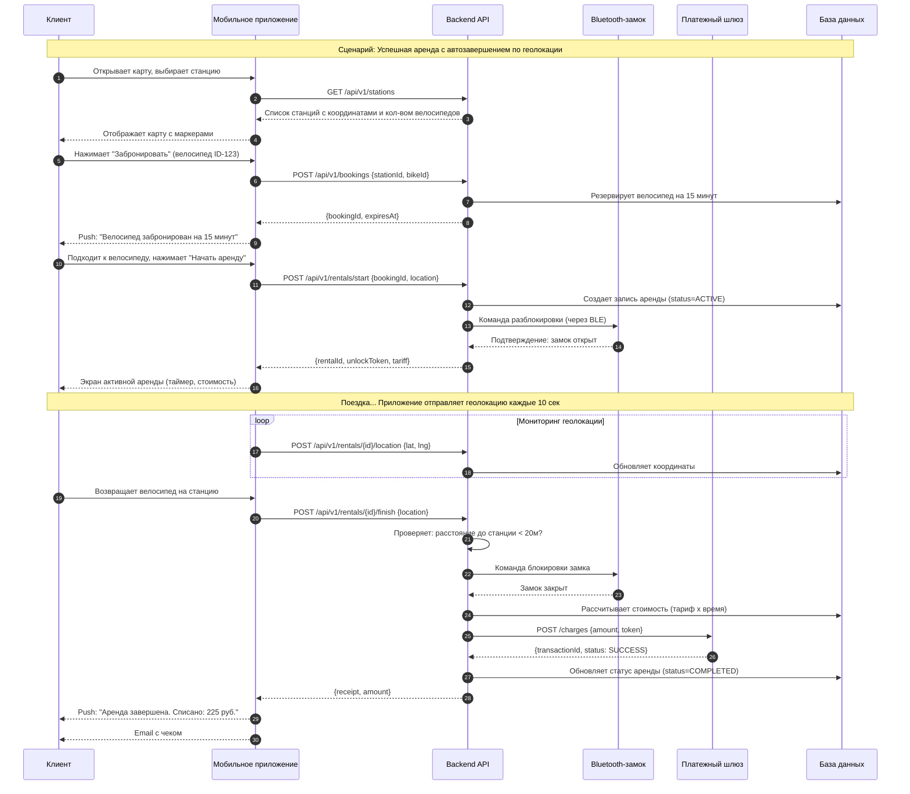

[⬅️ Вернуться к оглавлению](../README.md)

## 2. Sequence Diagram — Успешная аренда с автозавершением

```mermaid
sequenceDiagram
    autonumber
    participant C as Клиент
    participant App as Мобильное приложение
    participant API as Backend API
    participant Lock as Bluetooth-замок
    participant Pay as Платежный шлюз
    participant DB as База данных

    Note over C,DB: Сценарий: Успешная аренда с автозавершением по геолокации

    C->>App: Открывает карту, выбирает станцию
    App->>API: GET /api/v1/stations
    API-->>App: Список станций с координатами и кол-вом велосипедов
    App-->>C: Отображает карту с маркерами

    C->>App: Нажимает "Забронировать" (велосипед ID-123)
    App->>API: POST /api/v1/bookings {stationId, bikeId}
    API->>DB: Резервирует велосипед на 15 минут
    API-->>App: {bookingId, expiresAt}
    App-->>C: Push: "Велосипед забронирован на 15 минут"

    C->>App: Подходит к велосипеду, нажимает "Начать аренду"
    App->>API: POST /api/v1/rentals/start {bookingId, location}
    API->>DB: Создает запись аренды (status=ACTIVE)
    API->>Lock: Команда разблокировки (через BLE)
    Lock-->>API: Подтверждение: замок открыт
    API-->>App: {rentalId, unlockToken, tariff}
    App-->>C: Экран активной аренды (таймер, стоимость)

    Note over C,DB: Поездка... Приложение отправляет геолокацию каждые 10 сек

    loop Мониторинг геолокации
        App->>API: POST /api/v1/rentals/{id}/location {lat, lng}
        API->>DB: Обновляет координаты
    end

    C->>App: Возвращает велосипед на станцию
    App->>API: POST /api/v1/rentals/{id}/finish {location}
    API->>API: Проверяет: расстояние до станции < 20м?
    API->>Lock: Команда блокировки замка
    Lock-->>API: Замок закрыт
    API->>DB: Рассчитывает стоимость (тариф x время)
    API->>Pay: POST /charges {amount, token}
    Pay-->>API: {transactionId, status: SUCCESS}
    API->>DB: Обновляет статус аренды (status=COMPLETED)
    API-->>App: {receipt, amount}
    App-->>C: Push: "Аренда завершена. Списано: 225 руб."
    App-->>C: Email с чеком
```

[⬅️ Вернуться к оглавлению](../README.md)
