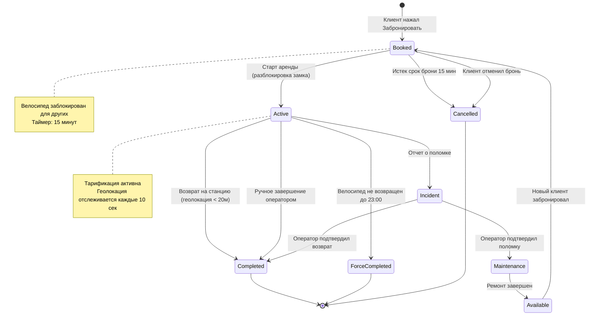

[⬅️ Вернуться к оглавлению](../README.md)

## 3. State Machine Diagram — Жизненный цикл аренды

```mermaid
stateDiagram-v2
    [*] --> Booked: Клиент нажал Забронировать

    Booked --> Active: Старт аренды (разблокировка замка)
    Booked --> Cancelled: Истек срок брони 15 мин
    Booked --> Cancelled: Клиент отменил бронь

    Active --> Completed: Возврат на станцию (геолокация < 20м)
    Active --> Completed: Ручное завершение оператором
    Active --> ForceCompleted: Велосипед не возвращен до 23:00
    Active --> Incident: Отчет о поломке

    Incident --> Completed: Оператор подтвердил возврат
    Incident --> Maintenance: Оператор подтвердил поломку

    Maintenance --> Available: Ремонт завершен
    Available --> Booked: Новый клиент забронировал

    Completed --> [*]
    ForceCompleted --> [*]
    Cancelled --> [*]

    note right of Active
        Тарификация активна
        Геолокация отслеживается каждые 10 сек
    end note

    note right of Booked
        Велосипед заблокирован для других
        Таймер: 15 минут
    end note
```

[⬅️ Вернуться к оглавлению](../README.md)
