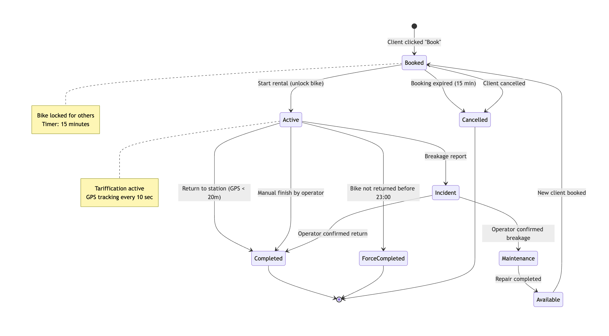

[⬅️ Вернуться к оглавлению](../README.md) | [← Предыдущая: Sequence Diagram](sequence-rental.md)

# 3. State Machine Diagram — Жизненный цикл аренды

Диаграмма состояний описывает все возможные статусы аренды и велосипеда, а также переходы между ними. Это ключевая диаграмма для разработки backend-логики и обработки граничных случаев.

## Описание состояний

| Состояние                                    | Описание                                                                                      |
| -------------------------------------------- | --------------------------------------------------------------------------------------------- |
| **Booked** (Забронирован)                    | Велосипед зарезервирован конкретным клиентом на 15 минут. Недоступен для других.              |
| **Active** (Активен)                         | Аренда начата, замок разблокирован. Идет тарификация, геолокация отслеживается каждые 10 сек. |
| **Completed** (Завершена)                    | Велосипед возвращен на станцию, средства списаны.                                             |
| **ForceCompleted** (Принудительно завершена) | Велосипед не возвращен до 23:00. Система автоматически завершила аренду.                      |
| **Incident** (Инцидент)                      | Клиент сообщил о поломке. Ожидает решения оператора.                                          |
| **Maintenance** (На ремонте)                 | Оператор подтвердил поломку. Велосипед исключен из доступного парка.                          |
| **Available** (Доступен)                     | Велосипед исправен и готов к новой аренде.                                                    |
| **Cancelled** (Отменена)                     | Бронь истекла (15 мин) или была отменена клиентом.                                            |

## Ключевые переходы

- **Booked → Active**: Клиент подошел к велосипеду и нажал «Начать аренду».
- **Booked → Cancelled**: Истек таймер брони (15 минут) без старта аренды.
- **Active → Completed**: Геолокация показала возврат на станцию (радиус < 20м).
- **Active → ForceCompleted**: Время 23:00, велосипед все еще в аренде.
- **Active → Incident**: Клиент нажал «Сообщить о поломке».
- **Incident → Maintenance**: Оператор подтвердил неисправность.
- **Maintenance → Available**: Ремонт завершен, велосипед снова в строю.

---

[⬅️ Вернуться к оглавлению](../README.md) | [← Предыдущая: Sequence Diagram](sequence-rental.md)
