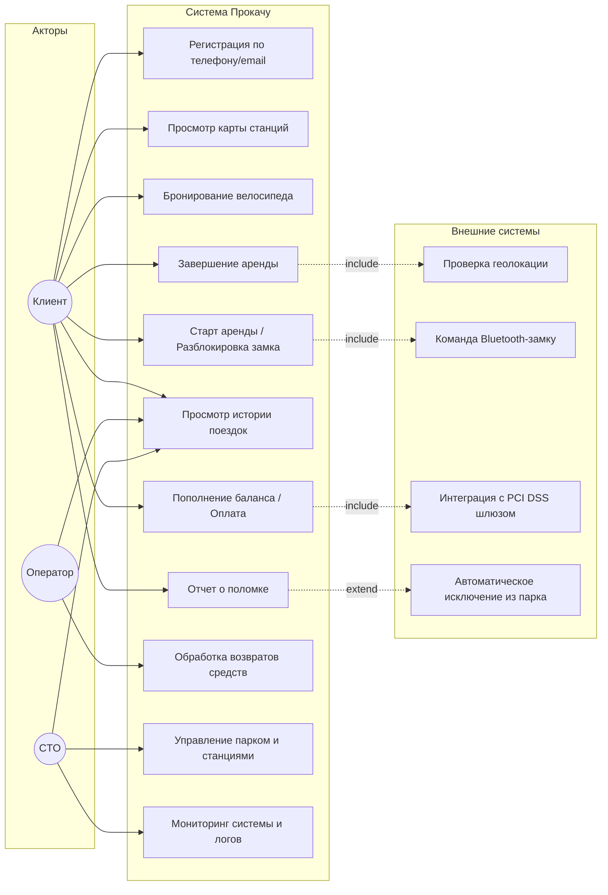

[⬅️ Вернуться к оглавлению](../README.md)

## 1. Use Case Diagram

```mermaid
flowchart LR
    subgraph Actours [Акторы]
        Client((Клиент))
        Operator((Оператор))
        CTO((CTO))
    end

    subgraph Prokachu [Система Прокачу]
        UC1[Регистрация по телефону/email]
        UC2[Просмотр карты станций]
        UC3[Бронирование велосипеда]
        UC4[Старт аренды / Разблокировка замка]
        UC5[Завершение аренды]
        UC6[Просмотр истории поездок]
        UC7[Отчет о поломке]
        UC8[Пополнение баланса / Оплата]
        UC9[Обработка возвратов средств]
        UC10[Управление парком и станциями]
        UC11[Мониторинг системы и логов]
    end

    Client --> UC1
    Client --> UC2
    Client --> UC3
    Client --> UC4
    Client --> UC5
    Client --> UC6
    Client --> UC7
    Client --> UC8

    Operator --> UC9
    Operator --> UC6

    CTO --> UC10
    CTO --> UC11
    CTO --> UC6

    UC5 -.->|include| UC12[Проверка геолокации]
    UC4 -.->|include| UC13[Команда Bluetooth-замку]
    UC8 -.->|include| UC14[Интеграция с PCI DSS шлюзом]
    UC7 -.->|extend| UC15[Автоматическое исключение из парка]

    subgraph External [Внешние системы]
        UC12
        UC13
        UC14
        UC15
    end
```

[⬅️ Вернуться к оглавлению](../README.md)
